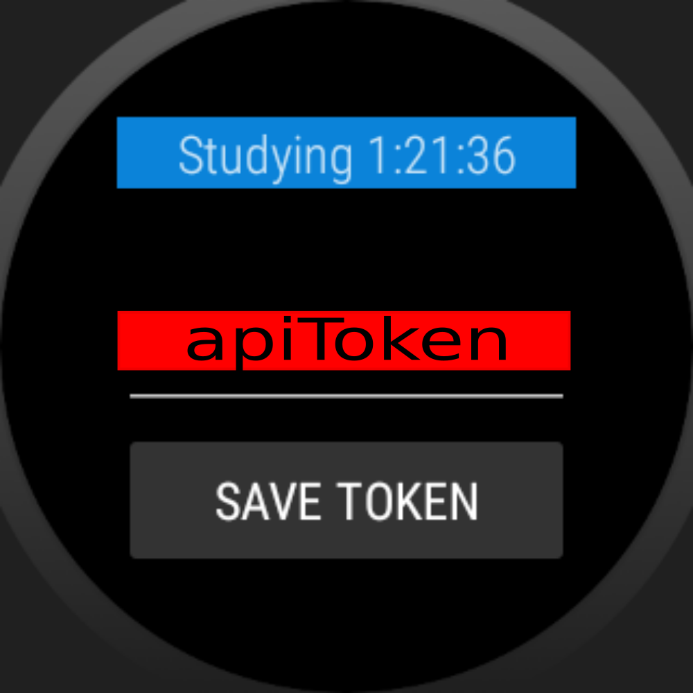
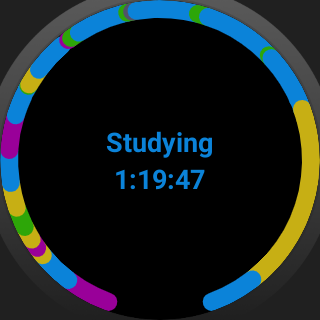

# About
Toggl Track is a great time tracking service! It's a shame though, there are no app for WearOS.

This project aims to fix this!

# Screenshots

# Disclaimer
This project is still in development.

Current features:

- Ability to see currently running timer on your watch.

- Tile with the following functionality:

    - Currently running timer

    - Resent timeline for a quick review of your day
    
Planned features:

- Ability to see currently running timer from complications

- Ability to start timers from the complications?

- Pomodoro notifications: pinging user after entities of some projects were running for some time (specified for each project) (only active for projects, selected by user)

# System requirements
This app targets api level 28 (Android 9/WearOS 2.2) and above

# Installation
Hope you have Android studio installed))))))

Or i heard that people use apps like this: https://play.google.com/store/apps/details?id=de.agondev.easyfiretools (this option is not tested by me)